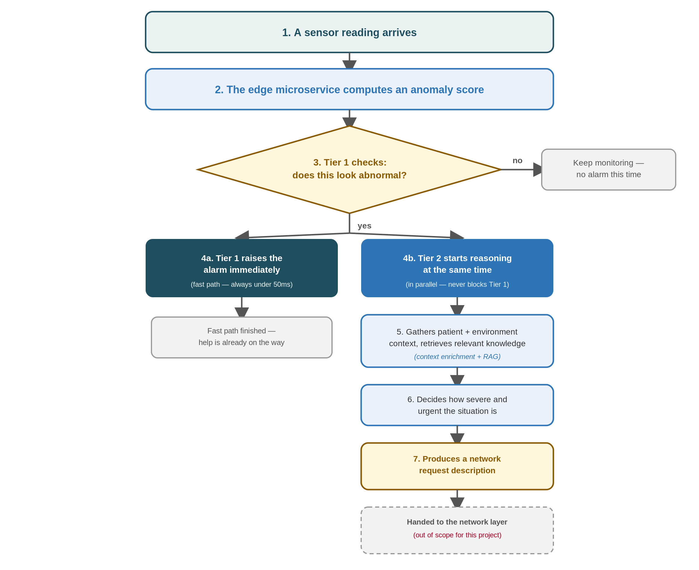
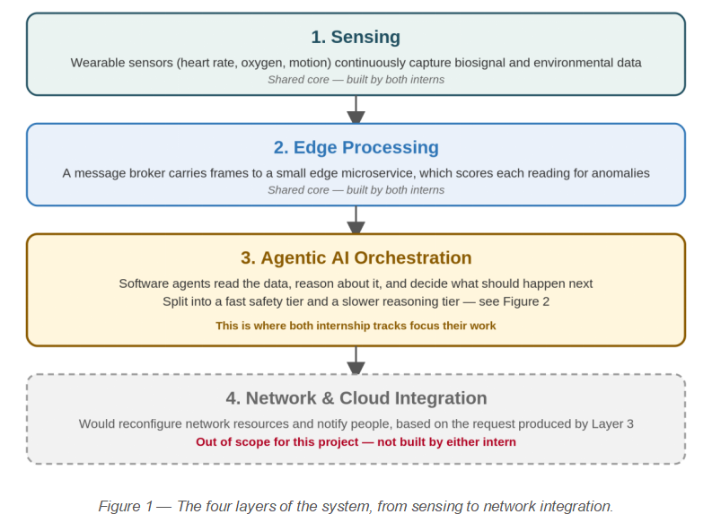
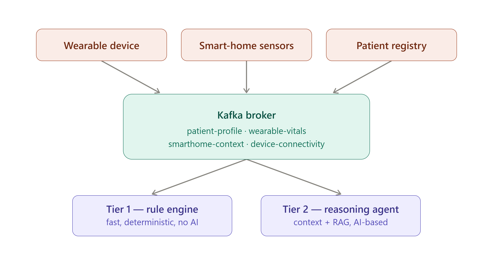
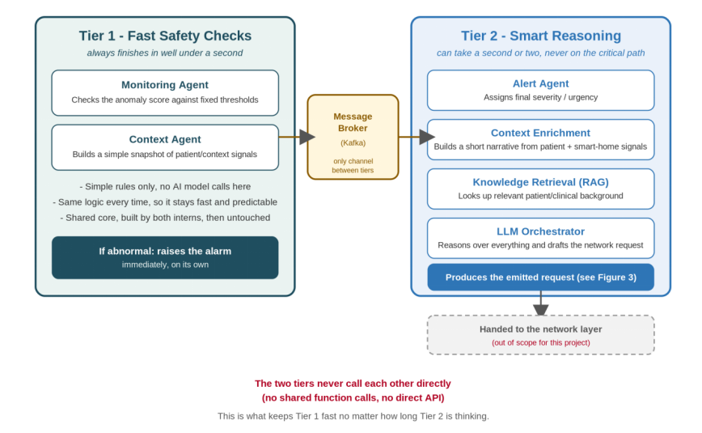
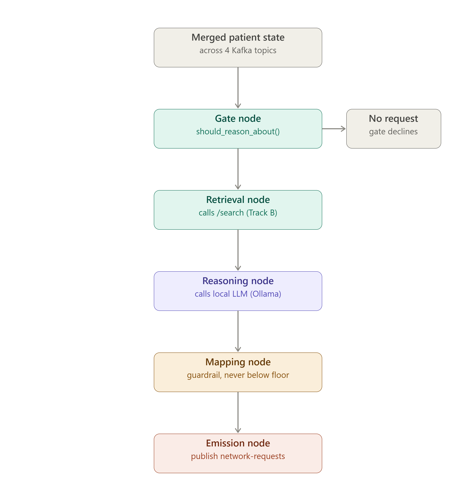

# Kafka Multi-Agent Medical Monitoring System

This repository implements a Kafka-based patient-monitoring platform for home-care and assisted-living scenarios. The flow starts with streaming sensor inputs, continues through fast Tier 1 safety checks, and then escalates to a slower Tier 2 reasoning and retrieval layer when a situation requires richer context or interpretation.

This project is designed as both an implementation and a research artifact. It includes the runtime architecture, benchmark runners, measured results, generated figures, and documentation that can be reused in a report or appendix.

## Repository map

- [kafka/](kafka/) — Kafka topic creation, fixture replay, and sensor simulation
- [tiers/](tiers/) — Tier 1 deterministic safety logic
- [TrackA/](TrackA/) — Tier 2 reasoning layer and framework comparison
- [TrackB/](TrackB/) — retrieval service, benchmark scripts, evaluation, and measured results
- [docs/](docs/) — report figures and supporting documentation assets
- [docker-compose.yml](docker-compose.yml) — local Kafka broker setup
- [requirement.txt](requirement.txt) — Python dependency list

Detailed sub-readmes:

- [TrackA/README.md](TrackA/README.md)
- [TrackB/README.md](TrackB/README.md)

---

## Executive summary

The system is organized in two processing tiers:

1. Tier 1 performs fast, deterministic safety evaluation.
2. Tier 2 adds context-aware reasoning and retrieval when weak signals, ambiguous conditions, or missing context complicate a patient event.

The design is not trying to replace clinical judgment with a single monolithic model; it is trying to create a practical home-monitoring pipeline that:

- reacts quickly when a patient is in an obvious danger zone,
- uses retrieval and reasoning only when needed,
- keeps a deterministic safety floor in place,
- produces a structured network request rather than taking action itself.

This architecture intentionally balances speed, safety, and transparency.

---

## System purpose

The project models a patient-monitoring environment in which sensor events and smart-home context are routed through Kafka and processed by multiple layers.

The core objectives are:

- ingest wearable, smart-home, and connectivity data
- detect clear-risk conditions immediately
- reason about more ambiguous scenarios
- fetch patient-specific context using retrieval
- attach a severity and urgency assessment
- produce a network request that describes the required connection quality and urgency

The project does not directly reconfigure network services, notify hospitals, or trigger real emergency workflows. It stops at generating a valid request artifact.

---

## Architecture overview

### Tier 1: fast safety layer

Tier 1 is the immediate-response layer. It reads alarm-producing inputs such as abnormal heart rate, low oxygen saturation, or fall detection and emits a fast, deterministic risk decision.

This layer is intentionally simple and human-auditable. It is not trying to infer intent; it is trying to enforce a stable safety threshold.

### Tier 2: reasoning and retrieval layer

Tier 2 sits behind Tier 1 and reasons only when the situation deserves a deeper look. It combines:

- current patient state
- patient history and document snippets from retrieval
- a local reasoning model
- a deterministic rule table for safety floor enforcement
- a final network-request artifact

This is covered in detail in [TrackA/README.md](TrackA/README.md).

### Track B: retrieval and benchmarking

Track B is responsible for the retrieval layer. It evaluates which vector database best supports patient-aware retrieval with metadata filters and production-style persistence.

This is covered in detail in [TrackB/README.md](TrackB/README.md).

---

## End-to-end workflow

The system works as a message-driven pipeline.



### High-level flow

1. Kafka receives sensor and context events.
2. Tier 1 processes current patient state.
3. Tier 2 decides whether deeper reasoning is needed.
4. Retrieval fetches relevant patient information.
5. The local reasoning model produces a judgment.
6. The guardrail keeps the decision from dropping below the rule-table floor.
7. A network-request object is emitted if the final severity warrants it.

---

## Four-layer system view

The project can also be understood as a four-layer system design.



These layers are:

- sensor and event input
- event transport and buffering
- tiered reasoning and rule evaluation
- support-request generation

---

## Kafka and topic model

The project uses Kafka to carry patient-monitoring events across the components. The topic model is designed to separate sensor readings from alerts and maintenance-style events.



The system listens on topics including:

- wearable-vitals
- smarthome-context
- device-connectivity
- patient-profile
- alarms

The message broker is started from [docker-compose.yml](docker-compose.yml).

---

## Tier 1 and Tier 2 architecture



This diagram shows the separation between:

- rule-based immediate alarms,
- contextual reasoning and retrieval,
- final severity mapping and output publication.

---

## Tier 2 real pipeline flow



This is the actual production-style flow used in Track A:

- incoming patient state is assembled
- a cheap gate decides whether to reason
- retrieval fetches context
- the reasoning model is called once
- the guardrail enforces safety rules
- the network request is created and published

---

## How the System Decides What Matters

Once Tier 2 has reasoned about a situation, it translates that judgment into two things: how severe or urgent it is, and what kind of network support that would call for.

The mapping used in the project is intentionally straightforward:

| Severity | What it generally means | What we ask the network for |
| --- | --- | --- |
| Critical | Life-threatening or rapidly worsening | A dedicated, guaranteed low-latency connection |
| High | Requires prompt attention | A dedicated but less strict connection |
| Moderate | Worth a closer look, not an emergency | A good-quality shared connection |
| Normal | Nothing abnormal detected | No special request |

This means the output is not a direct action; it is a structured support request describing the type of network quality the system would want if a real response path were activated.

---

## The scenarios used for evaluation

The same fixed set of scenarios is used across the system so the behavior can be tested and compared honestly.

### 8.1 Core scenarios

| ID | Situation | What should happen |
| --- | --- | --- |
| S1 | Irregular heartbeat + fall detected + low oxygen reading + patient elderly and alone | Classified as very severe; the system should request a dedicated, low-latency connection |
| S2 | All readings within normal range, nothing unusual | No alarm; no network request produced |
| S3 | Unusually slow heart rate, no other risk factors present | Classified as moderate; a good-quality but non-emergency connection is requested |

### 8.2 Context-enriched, deliberately ambiguous scenarios

| ID | Situation | What should happen |
| --- | --- | --- |
| S4 | No single reading crosses an alarm threshold, but three weak signals combine: mild heart-rate elevation, a hot room, and a missed medication dose, patient alone | Should raise a “watch closely” flag — a case a simple rule table would likely miss entirely |
| S5 | Heart-rate spike, an unanswered check-in, and a loud noise picked up by a smart speaker — but the fall sensor itself did not trigger | Should still be treated as a likely fall, by combining evidence the fall sensor alone would have missed |
| S6 | An alarm-level reading arrives at the same moment the wearable's connection briefly drops | The alarm still goes out immediately and unmodified — but the system can attach a note asking for a quick confirmation, since the drop makes the reading slightly less certain |

These scenarios are encoded in [kafka/scenarios.json](kafka/scenarios.json) and used in the benchmark and system validation flow.

The first three scenarios verify the basic pipeline. The last three exist to show why a reasoning tier is useful: each one contains a pattern that a fixed threshold table either misses or handles too bluntly.

---

## What is in scope vs. out of scope

### In scope

- sensor replay setup
- Kafka event flow
- Tier 1 alarm logic
- Tier 2 reasoning and retrieval
- severity and urgency mapping
- producing the network-request description

### Out of scope

- actually reconfiguring real network infrastructure
- real emergency dispatch or notification
- real smart-home hardware integration
- live hospital or clinical action workflows

The project intentionally stops at producing a well-formed support request instead of acting on it.

---

## Track A: reasoning architecture and framework decision

The main architectural comparison happens in [TrackA/README.md](TrackA/README.md).

### Reasoning framework comparison

The Track A evaluation compares three orchestration frameworks:

- LangGraph
- AutoGen
- CrewAI

The benchmark results show:

| Candidate | Median total ms | Median overhead ms |
| --- | ---: | ---: |
| LangGraph | 457.8 | 457.8 |
| AutoGen | 936.7 | 936.7 |
| CrewAI | 22648.9 | 22648.9 |

These values come from [TrackA/benchmark/results.json](TrackA/benchmark/results.json).

The project chooses LangGraph because it is the best match for a fixed-state, event-driven reasoning workflow with a single gate and low-latency execution overhead.

The Track A README includes the full breakdown of:

- install effort (hours)
- supported agent topologies
- state-persistence model
- integration with a self-hosted reasoning model
- latency overhead
- debuggability and observability
- community maturity and licensing
- fit as-is vs. adaptation needed

---

## Track B: retrieval architecture and database decision

The main retrieval benchmark and comparison are in [TrackB/README.md](TrackB/README.md).

### Vector-store benchmark results

The measured benchmark results are in [TrackB/docs/results.csv](TrackB/docs/results.csv):

| Store | Documents | Index time (s) | Avg latency (ms) |
| --- | ---: | ---: | ---: |
| Chroma | 6 | 0.120899 | 1.920 |
| FAISS | 6 | 0.000084 | 0.069 |
| Qdrant | 6 | 0.012289 | 0.828 |
| Chroma | 100 | 0.154131 | 2.439 |
| FAISS | 100 | 0.000133 | 0.066 |
| Qdrant | 100 | 0.036456 | 1.148 |
| Chroma | 1000 | 0.413993 | 1.978 |
| FAISS | 1000 | 0.000578 | 0.203 |
| Qdrant | 1000 | 0.263583 | 3.485 |

### Why Qdrant is chosen for the real-world implementation

Even though FAISS is the fastest in a raw local benchmark, Qdrant is selected as the production fit because it provides:

- native payload filtering by patient and metadata fields
- service-based deployment with persistence
- straightforward operational scaling
- a better fit for real patient-scoped document retrieval

The comparison file [TrackB/docs/comparison.csv](TrackB/docs/comparison.csv) classifies Qdrant as the best choice for the medical system.

The actual service is implemented in [TrackB/retrieval_service.py](TrackB/retrieval_service.py).

---

## RAGAS vs DeepEval: practical quality comparison

The project also evaluates retrieval quality with two frameworks, RAGAS and DeepEval, using the same patient queries and same local model judge. The actual results are in [TrackB/evaluation/results_eval_frameworks.csv](TrackB/evaluation/results_eval_frameworks.csv).

### Actual scores

| Framework | Metric | Score |
| --- | --- | ---: |
| RAGAS | faithfulness | 0.5400 |
| DeepEval | faithfulness | 0.5357 |
| RAGAS | answer_relevancy | 0.5800 |
| DeepEval | answer_relevancy | 0.5762 |
| RAGAS | context_precision | 0.8300 |
| DeepEval | contextual_precision | 0.8333 |
| RAGAS | context_recall | 0.2900 |
| DeepEval | contextual_recall | 0.2857 |

### Interpretation

There is no meaningful result gap between RAGAS and DeepEval for this project. The score differences are tiny:

- faithfulness: 0.0043 difference
- answer relevancy: 0.0038 difference
- context precision: 0.0033 difference
- context recall: 0.0043 difference

This shows that the choice between them is less about score quality and more about operational practicality.

### Install effort and runtime tradeoff

Both frameworks are relatively easy to install in a Python environment, but the runtime difference is meaningful:

| Framework | Total eval time |
| --- | ---: |
| RAGAS | ~10.18 s |
| DeepEval | ~98.59 s |

DeepEval produces almost the same scores but takes about 10x longer for the same evaluation workload. That makes RAGAS the more practical choice for repeated local evaluation and iteration.

---

## Benchmark and report figures

The project includes the generated figures from the vector-store benchmark, all stored under [TrackB/docs/figures](TrackB/docs/figures):

- [fig1_latency_vs_corpus_size.png](TrackB/docs/figures/fig1_latency_vs_corpus_size.png)
- [fig2_index_time_vs_corpus_size.png](TrackB/docs/figures/fig2_index_time_vs_corpus_size.png)
- [fig3_percentile_comparison.png](TrackB/docs/figures/fig3_percentile_comparison.png)
- [fig4_latency_distribution_boxplot.png](TrackB/docs/figures/fig4_latency_distribution_boxplot.png)

Related benchmark appendix:

- [TrackB/docs/appendix_A.md](TrackB/docs/appendix_A.md)
- [TrackB/docs/comparison.csv](TrackB/docs/comparison.csv)
- [TrackB/docs/results.csv](TrackB/docs/results.csv)

---

## Operational notes and deployment fit

### Install effort (hours)

- Track A framework comparison: around 1–2 hours to establish the setup and run benchmarks
- Track B retrieval environment: around 1–3 hours depending on whether the developer needs to install vector DB tooling and local evaluation dependencies
- RAGAS vs DeepEval: effectively similar setup cost, but RAGAS is faster to iterate with

### Runs on target env. (edge HW / cluster)

This system is designed for a practical deployment range that includes:

- local or edge-based gateway nodes,
- a central processing layer,
- Docker-based development and test clusters,
- a service-based vector database backend such as Qdrant.

Qdrant is the best fit for both a modest local deployment and a future cluster-style deployment because it behaves like a real service rather than a simple embedded library.

### Key metrics produced

The project produces the following metrics:

- retrieval latency by store and corpus size
- indexing time
- p50 / p95 / p99 / max latency
- evaluation quality metrics from RAGAS and DeepEval
- framework overhead comparison for Track A orchestration options
- patient-event and network-request results from the scenario replay

### Maps to project needs

| Need | Best match | Why |
| --- | --- | --- |
| Fast alarm processing | Tier 1 + deterministic rules | Lowest latency and highest explainability |
| Ambiguous patient state interpretation | LangGraph + retrieval + LLM | Good state flow and low orchestration overhead |
| Patient-scoped retrieval | Qdrant | Native metadata filtering and proper service model |
| Reproducible evaluation | RAGAS | Similar quality to DeepEval, much faster |
| Safe deployment behavior | Guardrails and rule-table floor | Prevents unsafe downgrade of risk severity |

### Fit as-is / needs adaptation

- Track A as-is: good fit for the current event-driven architecture
- Track A with broader multi-agent delegation: possible but not necessary for the current problem
- Track B as-is: strong fit for the current retrieval layer and patient-specific filtering
- Qdrant in larger production clusters: requires deployment adaptation, but not a redesign

---

## Quick start

### Start Kafka

```powershell
docker compose up -d
```

### Create Kafka topics

```powershell
python kafka\Create_topics.py
```

### Replay scenarios

```powershell
python kafka\Fixtures.py
```

### Run Tier 1

```powershell
python tiers\tier1_agent.py
```

### Run Tier 2

```powershell
python -m TrackA.tier2_agent
```

### Start retrieval service

```powershell
python TrackB\retrieval_service.py
```

### Run smoke checks

```powershell
python TrackB\test_retrieval_service.py
```

### Generate benchmark figures

```powershell
python TrackB\retrieval\plot_benchmark.py
```

---

## Final conclusion

This repository is best understood as a two-track system:

- Track A chooses a reasoning architecture that is explicit, low-overhead, and safe.
- Track B chooses a retrieval backend that is operationally strong rather than merely the fastest in a microbenchmark.

The evidence points to the following decisions:

- LangGraph is the preferred orchestration framework for Tier 2.
- Qdrant is the preferred retrieval backend for the real-world implementation.
- RAGAS is the more practical evaluation framework in this project, because it produces nearly identical quality scores to DeepEval while being substantially faster.

The end result is a system that is safer, easier to explain, and better aligned with real-world healthcare-monitoring needs than a purely fast but operationally weak architecture.

For the detailed Track A and Track B breakdowns, see:

- [TrackA/README.md](TrackA/README.md)
- [TrackB/README.md](TrackB/README.md)

