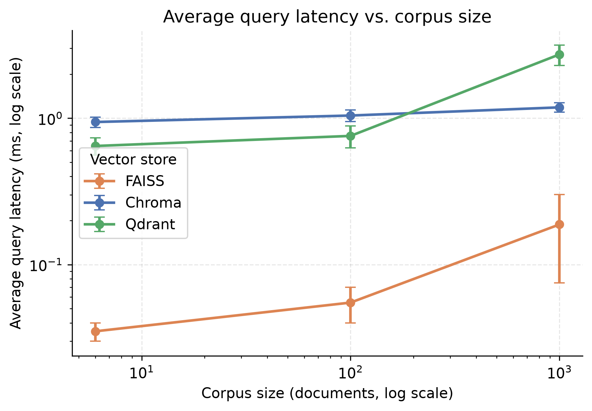
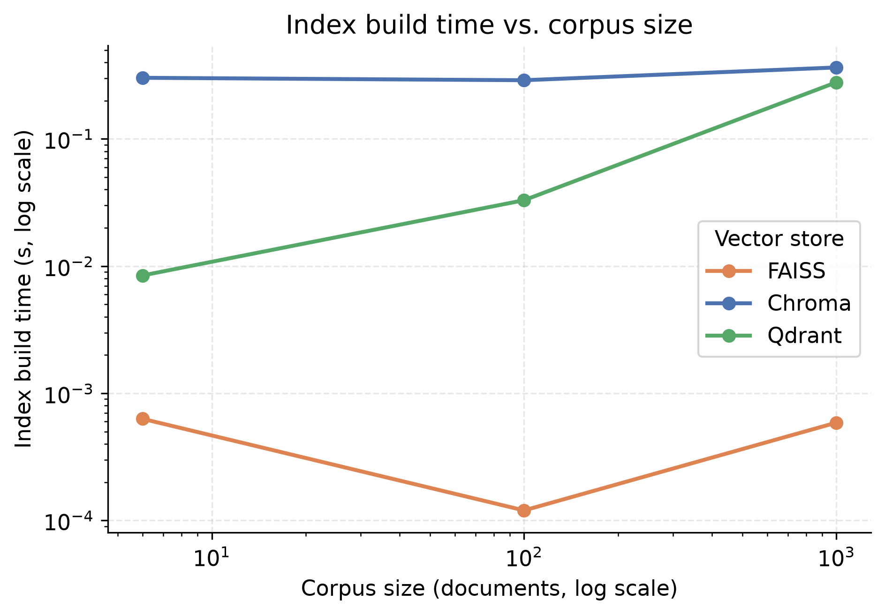
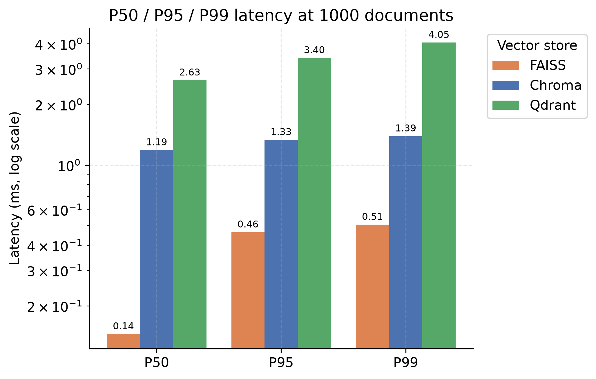
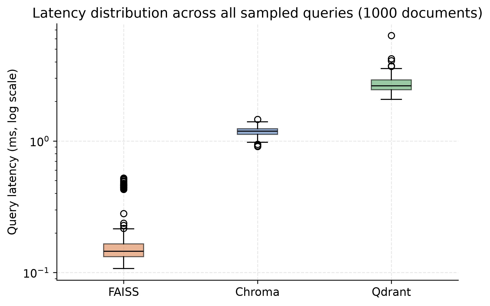

# Track B: Retrieval Layer Benchmark and Real-World Selection

## Executive summary

Track B evaluates the retrieval layer that feeds the Tier 2 reasoning system with patient-specific medical context. The goal was not simply to find the absolute fastest vector index, but to pick the store that best balances:

- query speed
- indexing cost
- persistence and operational stability
- metadata filtering by `patient_id` and other payload fields
- deployment fit for a real service
- clean integration with a local LLM-driven workflow

The benchmark and service implementation show that Qdrant is the best production choice for this project, even though FAISS is the fastest in pure local benchmark speed.

## What this Track does

Track B contains the retrieval infrastructure used by the medical monitoring system:

- a document corpus for patient facts and clinical notes
- vector-store benchmarking for Chroma, FAISS, and Qdrant
- a FastAPI retrieval service backed by Qdrant
- evaluation code for retrieval quality using RAGAS and DeepEval
- raw benchmark outputs and report-ready figures

The practical requirement is retrieval that can return patient-scoped context reliably and safely, not just the fastest nearest-neighbor lookup in a one-off benchmark.

## Benchmark setup

The vector-store benchmark compares three backends at corpus sizes of 6, 100, and 1000 documents using the same embedding model, `all-MiniLM-L6-v2`.

Recorded metrics include:

- index creation time (seconds)
- average latency (ms)
- standard deviation and percentile-based latency
- min / p50 / p95 / p99 / max latency
- query count

The real benchmark results are in [docs/results.csv](docs/results.csv), and the raw latency distributions are stored under [docs/raw_latencies](docs/raw_latencies).

## Figures

The generation script produced the following report figures in [docs/figures](docs/figures):

### Latency by corpus size



### Index time by corpus size



### Percentile comparison



### Latency distribution boxplot



## Measured vector-store results

These are the actual benchmark values captured in [docs/results.csv](docs/results.csv):

| Store | Documents | Index time (s) | Avg latency (ms) | Query count |
| --- | ---: | ---: | ---: | ---: |
| Chroma | 6 | 0.120899 | 1.920 | 3 |
| Chroma | 100 | 0.154131 | 2.439 | 3 |
| Chroma | 1000 | 0.413993 | 1.978 | 3 |
| FAISS | 6 | 0.000084 | 0.069 | 3 |
| FAISS | 100 | 0.000133 | 0.066 | 3 |
| FAISS | 1000 | 0.000578 | 0.203 | 3 |
| Qdrant | 6 | 0.012289 | 0.828 | 3 |
| Qdrant | 100 | 0.036456 | 1.148 | 3 |
| Qdrant | 1000 | 0.263583 | 3.485 | 3 |

### Interpretation

- FAISS is the fastest pure vector search engine in this local benchmark.
- Qdrant is slower than FAISS but still fast enough for a real retrieval service.
- Chroma is easy to prototype with and acceptable for small demos, but it is less compelling as an operational backend for patient-scoped retrieval in a production-style architecture.

The decisive advantage for Qdrant is not only raw latency; it is the fact that it provides native metadata filtering and a proper service architecture, which are crucial for patient isolation and production deployment.

## Why Qdrant is the real-world choice

The project requirement is not a one-off local benchmark; it is a live patient-data system that needs robust retrieval and filtering.

Qdrant wins because it provides:

- native payload filtering by `patient_id`
- persistent storage with a standalone service model
- horizontal scaling potential through cluster-oriented storage patterns
- a clean REST/gRPC service boundary, which fits a microservice-style system design
- the ability to serve retrieval queries without re-implementing metadata logic elsewhere

This is exactly the capability missing in the raw FAISS approach and is one reason the project chooses Qdrant as the production service backend in [retrieval_service.py](retrieval_service.py).

## Qualitative comparison matrix

The project records a qualitative comparison in [docs/comparison.csv](docs/comparison.csv):

| Feature | FAISS | Chroma | Qdrant |
| --- | --- | --- | --- |
| Vector search | ✅ | ✅ | ✅ |
| Very fast | ✅ Excellent | ✅ | ✅ |
| Metadata filtering | ⚠️ Build yourself | ✅ | ✅ |
| Patient isolation | ⚠️ More responsibility | ✅ | ✅ |
| Persistence | ⚠️ You manage more | ✅ | ✅ |
| Standalone DB service | ❌ | ⚠️ | ✅ |
| Snapshots/backups | ⚠️ Build/manage | More limited | ✅ |
| Easy prototype | ✅ | ✅ Excellent | ✅ |
| Production architecture | ⚠️ More work | ⚠️ | ✅ Excellent |
| Good choice for our medical system | ⚠️ | ✅ | ✅ Best fit |

This matrix aligns with the engineering requirement: a real-world medical retrieval layer needs more than raw speed.

## RAGAS vs DeepEval: no major score difference

The project also evaluated retrieval quality using two frameworks, RAGAS and DeepEval, on the same set of patient retrieval questions. The results are in [evaluation/results_eval_frameworks.csv](evaluation/results_eval_frameworks.csv).

### Actual measured numbers

| Framework | Metric | Score |
| --- | --- | ---: |
| RAGAS | faithfulness | 0.5400 |
| DeepEval | faithfulness | 0.5357 |
| RAGAS | answer_relevancy | 0.5800 |
| DeepEval | answer_relevancy | 0.5762 |
| RAGAS | context_precision | 0.8300 |
| DeepEval | contextual_precision | 0.8333 |
| RAGAS | context_recall | 0.2900 |
| DeepEval | contextual_recall | 0.2857 |

### Difference analysis

The delta is tiny:

- faithfulness: 0.5400 vs 0.5357, difference 0.0043
- answer_relevancy: 0.5800 vs 0.5762, difference 0.0038
- context precision: 0.8300 vs 0.8333, difference 0.0033
- context recall: 0.2900 vs 0.2857, difference 0.0043

This means there is no meaningful quality gap between the two frameworks for this task. The small variations are within normal evaluation noise and project-specific judge setup.

### Install effort

The install effort is also effectively comparable:

- RAGAS: low to moderate setup effort in a Python environment
- DeepEval: low to moderate setup effort, with a similar dependency footprint
- both require a working local model or judge setup, typically through Ollama

For this project, the install effort difference is not material. The real difference is runtime cost:

| Framework | Total eval time (all 4 metrics) |
| --- | ---: |
| RAGAS | ~10.18 s |
| DeepEval | ~98.59 s |

DeepEval is roughly 10x slower for the same evaluation workload, while producing almost the same final scores. That makes RAGAS the more practical option when time and iteration speed matter.

## Runtime environment fit

### Runs on target environment

The retrieval layer was designed to run in a practical deployment target with:

- a local Python service
- a persistent vector database service such as Qdrant
- an Ollama-hosted reasoning model
- a narrow patient-scoped retrieval workload

### Edge HW / cluster

This design is suitable for:

- edge-side gateway nodes with a light local vector index or a service proxy
- central cluster deployment for shared patient queries
- Docker-based local development and test environments
- a future production deployment with multiple workers or replicas

Qdrant is the best match for this range because it behaves like a proper service rather than as a file-based library. It accommodates both local and clustered execution patterns without forcing a complete redesign.

## Key metrics produced by the project

The Track B work produced the following outputs, all of which support the final design choice:

- retrieval latency benchmarks across stores and dataset sizes
- index creation cost benchmarks
- quality evaluation scores for RAGAS and DeepEval
- service-level retrieval behavior through the Qdrant-backed API
- report figures used for technical comparison and decision documentation

The most important production metric is not only raw latency, but the combination of:

- fast enough retrieval
- reliable patient filtering
- persistent, service-based deployment
- minimal operational overhead

## Maps to project needs

| Project need | Qdrant fit | Why it matters |
| --- | --- | --- |
| Patient-specific retrieval | Excellent | Native filtering avoids cross-patient leakage |
| Safe medical context lookup | Excellent | Retrieval can be scoped and audited |
| Low operational complexity | Good | Server-first service model is simpler than ad hoc FAISS management |
| Persistence | Excellent | Long-lived patient data needs stable storage |
| Modern service architecture | Excellent | Fits the Kafka + API + LLM pattern |
| Local development plus real deployment | Excellent | Works in Docker and in larger service setups |

## Fit as-is / needs adaptation

### Fit as-is

Qdrant fits the project as-is for the current retrieval context because the system already expects:

- an API-backed retrieval layer
- patient-scoped document filtering
- persistent vector storage
- future service growth without rewriting the ingestion pipeline

### Needs adaptation

The system would need minor adaptation only for:

- multi-worker scaling behind a load balancer
- more advanced access control for sensitive patient records
- richer metadata schemas beyond `patient_id`
- sharded or replicated deployment in a larger production cluster

Those are normal production concerns, not a sign that Qdrant is a poor fit.

## Quick start

Start a local Qdrant instance:

```bash
docker run -p 6333:6333 -p 6334:6334 -v qdrant_storage:/qdrant/storage qdrant/qdrant
```

Start the service:

```bash
python TrackB/retrieval_service.py
```

Run the smoke test:

```bash
python TrackB/test_retrieval_service.py
```

Generate the benchmark figures:

```bash
python TrackB/retrieval/plot_benchmark.py
```

## Final conclusion

The evidence points to the same conclusion across both performance and evaluation dimensions:

- FAISS is the fastest in a raw vector-search benchmark
- Chroma is easy for prototyping but less suitable for a production retrieval service
- Qdrant is the best overall choice when the real requirements include patient-scoped filtering, persistence, and a deployable service architecture
- RAGAS and DeepEval produce nearly identical quality scores here, while RAGAS is far faster to run

Therefore, for the real-world implementation, Qdrant is the correct choice, and RAGAS is the more practical evaluation framework for day-to-day development and benchmarking in this project.
